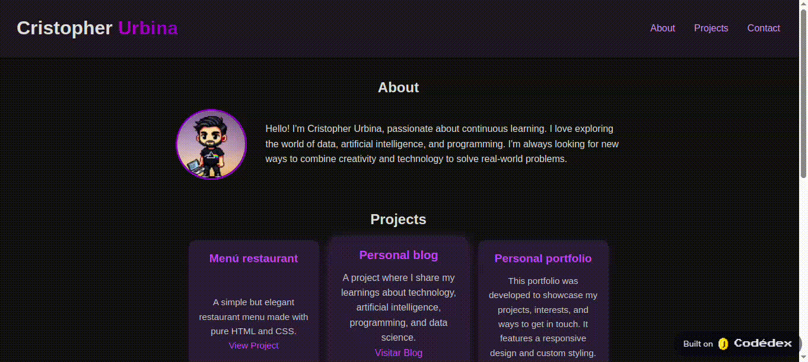

# 🎨 CSS Fundamentals — The Origins Trilogy

  

This repository contains the exercises and projects completed during the [Codedex](https://www.codedex.io/@CrisU8) CSS course — part of **The Origins Trilogy**, a foundational web development series.

Throughout this course, I learned the **fundamentals of CSS**, including how to target elements with selectors, style them with properties, and build responsive layouts using Flexbox and Grid.  
This repository documents my progress and understanding of visual design principles for the web and includes a final project that applies all the concepts learned.

---

## 🎨 What is CSS?

**CSS (Cascading Style Sheets)** is the language used to describe how HTML content is displayed on screen.  
It allows developers to control the appearance of web pages by defining:
- Colors and fonts
- Spacing and alignment
- Layout structure
- Responsive behavior  
  While HTML structures the content, CSS brings it to life.

---

## 📘 Course Chapters

### 🔎 [Selectors](./01-selectors)
In this chapter, we learned how to **target and style specific HTML elements** using CSS selectors. Selectors are essential to apply styles effectively and precisely across a web page.

We covered:

- **Element Selectors** – Target all elements of a specific type.  
  Example: `p { color: blue; }`

- **Class Selectors** – Target elements with a specific class using `.` notation.  
  Example: `.highlight { background-color: yellow; }`

- **ID Selectors** – Target a unique element with a specific ID using `#`.  
  Example: `#main-title { font-size: 2rem; }`

- **Grouping Selectors** – Apply the same style to multiple elements at once.  
  Example: `h1, h2, h3 { font-family: sans-serif; }`

- **Combinators** – Target elements based on their relationship to others:
    - Descendant (`div p`)
    - Child (`ul > li`)
    - Adjacent sibling (`h1 + p`)
    - General sibling (`h1 ~ p`)

- **Pseudo-classes** – Style elements based on their state or position.  
  Example: `a:hover`, `li:first-child`, `input:focus`

🎯 By mastering selectors, we gained the ability to apply styles with precision, structure CSS code cleanly, and prepare for more advanced styling techniques in future chapters.

---

### 🎨 [Properties](./02-properties)
This chapter introduced the core tools used to style HTML elements with CSS, focusing on how to make content visually appealing and readable.

We explored:

- **Text Formatting** – How to style fonts using:
    - Font families (`serif`, `sans-serif`, `monospace`, `cursive`, `fantasy`)
    - Font size and weight
    - Text alignment (`left`, `center`, `right`, `justify`)
    - Text decoration (underline, overline, line-through)

- **Colors** – Applied through different formats:
    - Named colors (`blue`, `red`, `green`)
    - RGB values (`rgb(255, 0, 0)`)
    - Hexadecimal codes (`#ff0000`)

- **Element Sizing** – Controlled with `width`, `height`, `max-width`, and `min-height`, using:
    - Absolute units (e.g. `px`)
    - Relative units (e.g. `%`, `em`, `rem`, `vw`, `vh`)

- **Backgrounds** – Styling element backgrounds with:
    - Solid colors
    - Background images
    - Positioning and repeating options

- **Borders** – Defining element edges with style, width, and color.
    - Example: `border: 2px solid black;`

- **Spacing** – Managed with:
    - `margin`: space outside the element
    - `padding`: space inside the element

- **Shorthand Properties** – Combining multiple style rules into one line:
    - Example: `margin: 10px 20px;` sets vertical and horizontal margins at once.

🎯 These tools gave us the ability to create a cohesive and consistent visual design across a web page, preparing us for more advanced layout techniques in the next chapters.

---

### 📦 [Box Model](./03-boxmodel)
In this chapter, we explored the **CSS box model**, which defines how every element on a web page occupies space. It breaks down an element’s dimensions into multiple layers:

- **Content** – The actual text, image, or other content within the element.
- **Padding** – The space between the content and the border.
- **Border** – The outer edge of the element, which can be styled (e.g. solid, dashed, rounded).
- **Margin** – The space outside the border, separating the element from others.

📚 **Key Takeaways**:
- The box model is essential for understanding layout and spacing in CSS.
- The **padding box** surrounds the content, creating inner spacing.
- The **border box** encloses both content and padding.
- The **margin box** creates space between adjacent elements.
- CSS offers two box-sizing models:
    - `content-box`: Width/height applies to the content only.
    - `border-box`: Width/height includes content, padding, and border.

This chapter was fundamental in learning how to control spacing and layout with precision.

---

### 🧱 [Layout](./04-layout)
This chapter focused on organizing and positioning content effectively using modern CSS tools and techniques. We covered:

- **Block and inline elements** – Understanding how elements naturally flow on a page.
- **The `display` property** – Controlling how elements appear (inline, block, flex, grid, etc.).
- **Flexbox** – Creating flexible and responsive layouts with ease.
- **CSS Grid** – Building precise, two-dimensional structures.
- **The `position` property** – Placing elements inside or outside the normal document flow.

---

### 🚀 [Final Project: Personal portfolio](./final_project)

To conclude this chapter, I built a complete and responsive personal website that showcases:

- ✅ A flexible layout using **Flexbox** and **CSS Grid**
- ✅ A semantic and accessible **HTML5 structure**
- ✅ Custom-styled and consistent **UI components**
- ✅ An interactive and validated **contact form**

This project brings together all the core concepts covered — from layout techniques to form handling — in a clean and modern design.

#### 🔗 Live Website: [View Project](https://www.codedex.io/jkdCvi30fTvSsyZ6c12p/live)

📸 **Project Preview**  

---

  

